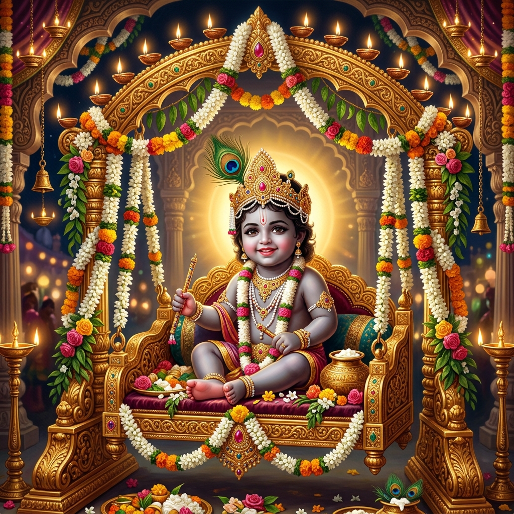

# 🌸 Shri Krishna Janmashtami — Sacred Katha & Darshan 🪈

An immersive, animated, and interactive web experience celebrating the holy appearance of Lord Shri Krishna (**Janmashtami**).



## ✨ Key Highlights

- **Hare Krishna Prologue & Gita Invocation**: Featuring Chapter 4, Verse 7 (*"Yada Yada Hi Dharmasya..."*) with cosmic visual reveals.
- **Four Distinct Chapters**:
  1. **Chapter I**: *The Tyranny of Kansa & The Prophecy* (Mathura in Shadows)
  2. **Chapter II**: *Midnight Advent in the Dungeon* (Divine Appearance under Rohini Nakshatra)
  3. **Chapter III**: *Crossing the Raging Yamuna* (Sheshanaga's Canopy & Parting Waters)
  4. **Chapter IV**: *Joy in Gokul — Nand Ke Ghar Anand Bhayo* (Celebration & Dahi Handi)
- **Celestial Flute (Bansuri) Darshan**:
  - Interactive SVG Bansuri with playable note holes tuned to Indian classical frequencies (Raag Yaman).
  - Authentic procedural Tanpura drone + Bansuri melody generated using Web Audio API.
- **Bal Gopal Jhula (Cradle) Darshan**:
  - Interactive swinging mechanism with natural physics dampening.
  - Authentic temple brass bell (Ghanta) synthesized using harmonic partials.
  - Dynamic flower petal shower system (`HTML5 Canvas`).
  - Aarti Kunjbihari Ki darshan modal and Makhan-Mishri offering.

## 🚀 Live Demo / Usage

Open `index.html` or `site.html` directly in any modern browser, or run a local web server:

```bash
python3 -m http.server 8080
```
Then visit [http://localhost:8080](http://localhost:8080).

## 🛠️ Built With

- **HTML5 & CSS3** (Custom design tokens, glassmorphism, responsive typography)
- **GSAP (GreenSock) & ScrollTrigger** (Smooth scroll choreography and timeline reveals)
- **Web Audio API** (Procedural synthesis for Raag Yaman flute melody, Tanpura drone, and temple bells)
- **HTML5 Canvas** (Dynamic particles for flower showers, rain, and cosmic ambiance)

## 🙏 Shloka

> यदा यदा हि धर्मस्य ग्लानिर्भवति भारत ।  
> अभ्युत्थानमधर्मस्य तदात्मानं सृजाम्यहम् ॥  
> *— Srimad Bhagavad Gita 4.7*

Jai Shri Krishna! 🌺
